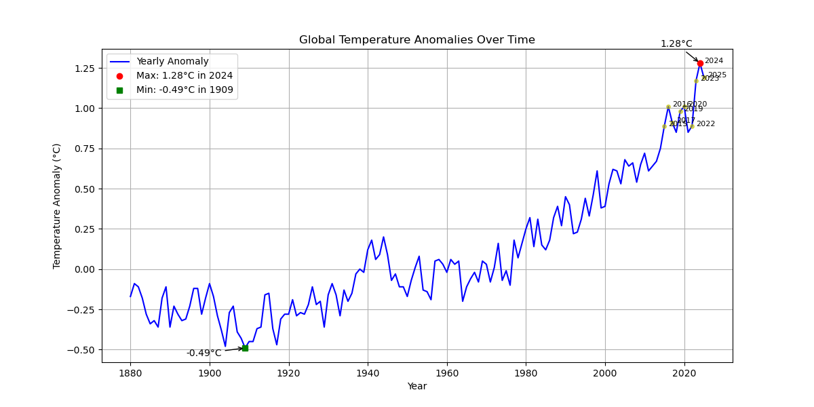

Global Temperature Anomaly Analysis (Python)

Part of a growing portfolio in environmental data analysis using Python.

## Project Overview

This project analyses global temperature anomaly data to explore long-term climate trends using Python.

The workflow includes:
- Data cleaning and validation (pure Python and pandas)
- Statistical analysis (mean, standard deviation, extreme values)
- Visualisation (line plots, scatter plots, decadal averages)

Key findings:
- A clear long-term warming trend, accelerating after ~1980
- Short-term yearly variability, but strong long-term consistency
- Increasing frequency of extreme anomaly years in recent decades

This project demonstrates how simple data analysis techniques can reveal meaningful environmental patterns from real-world datasets.

Features

Load and clean CSV climate data

Handle missing values

Compute:

Average anomaly

Maximum anomaly year

Minimum anomaly year

Visualise temperature trends using matplotlib

Highlight the year with the highest anomaly

Dataset

The dataset contains global land-ocean temperature anomalies from 1880 to present.

Column used: J-D (January–December annual average)

Missing values handled appropriately (e.g. incomplete 2026 data)

Results & Insights

Global temperature anomalies show a clear long-term warming trend.

Warming accelerates significantly after ~1980.

The highest anomalies occur in the most recent years.

Even small anomaly increases (e.g. +0.15°C) represent significant shifts in global climate systems.

Interpretation

Temperature anomalies measure deviation from a baseline (1951–1980), making them more reliable than absolute temperatures for detecting climate trends.

The data indicates a sustained and accelerating increase in global temperatures, consistent with broader climate science findings.

Technologies Used

Python

Jupyter Notebook

matplotlib

Git & GitHub

How to Run

Clone the repository

Open the notebook:
temperature_anomaly.ipynb

Run all cells

Key Insight

Temperature anomalies provide a clearer view of climate change than raw temperatures, showing how much the Earth is warming relative to a historical baseline.

Updates

## Update Mar 20th 2026
- Added anomaly detection using standard deviation
- Highlighted extreme temperature years
- Introduced decadal averaging for trend smoothing

## Update Mar 30th 2026

Produced multiple plots:
Yearly anomalies (line plot with max/min points annotated)
Scatter plot highlighting extreme years
Decadal averages (bar chart, both pure Python and pandas version)
Introduced pandas for data handling, demonstrating:
Data cleaning with to_numeric and dropna()
Grouping by decades with .groupby('Decade')['J-D'].mean()
Optional features included annotating plots and wrapping pandas preprocessing into a function.

## Temperature Trend (Scatter Plot)

## Extreme Years (Scatter Plot)

## Decadal Averages (Bar Chart)

## Decadal Averages (Pandas)

## Conclusions

- Global temperature anomalies show a clear long-term warming trend, particularly accelerating after ~1980.

- While individual years fluctuate above and below the baseline, decadal averages smooth out this variability and reveal a consistent upward trend.

- Extreme years (defined as values more than 2 standard deviations from the mean) become more frequent in recent decades, indicating increasing variability alongside overall warming.

- The analysis highlights the importance of distinguishing between:
  - Short-term variability (year-to-year changes)
  - Long-term climate trends (multi-decade warming)

- Comparing pure Python and pandas approaches shows that:
  - Pure Python provides transparency and understanding of the underlying calculations
  - pandas enables faster, more efficient data analysis for larger datasets

This project demonstrates how simple data analysis techniques can reveal meaningful climate patterns using real-world environmental data.

Future work could include seasonal analysis, regional comparisons, or applying regression models to quantify warming trends.

👤 Author

Gaynor Jones

## Related Projects

- River Analysis Pipeline (Python)  
  https://github.com/GaynorJones/River-Analysis-Pipeline-Python